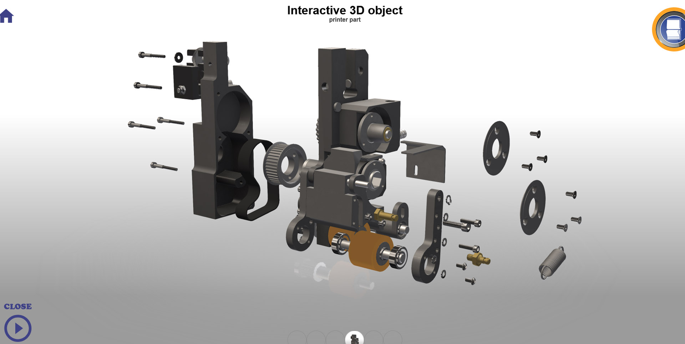

# CAO 3d Interactive object

## Welcome! 👋

I created this application in order to better understand the needs of industrial companies and thus create a workflow allowing me to quickly make efficient visualizations from 3d objects provided by factories.

The 3d files coming out of factories are very complex, have millions of polygons, duplicate and triple 3d parts.
On the other hand, in webGl you only display what you see and two identical topologies must be instances.

So I had to create some addons like [Clean mesh](https://github.com/jeanclaude25/Clean_meshes_Blender2.9) or InstanceToempty to make this possible.

Today, I know better how to answer industrial proposals thanks to this work.

[Try this app](https://www.jeanclaudestephane.com/virtual_visit/version/last/)

**Have fun !** 🚀
